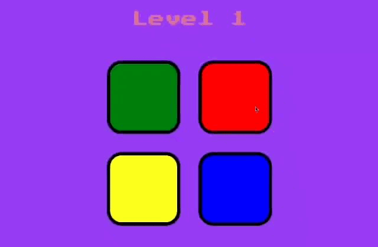
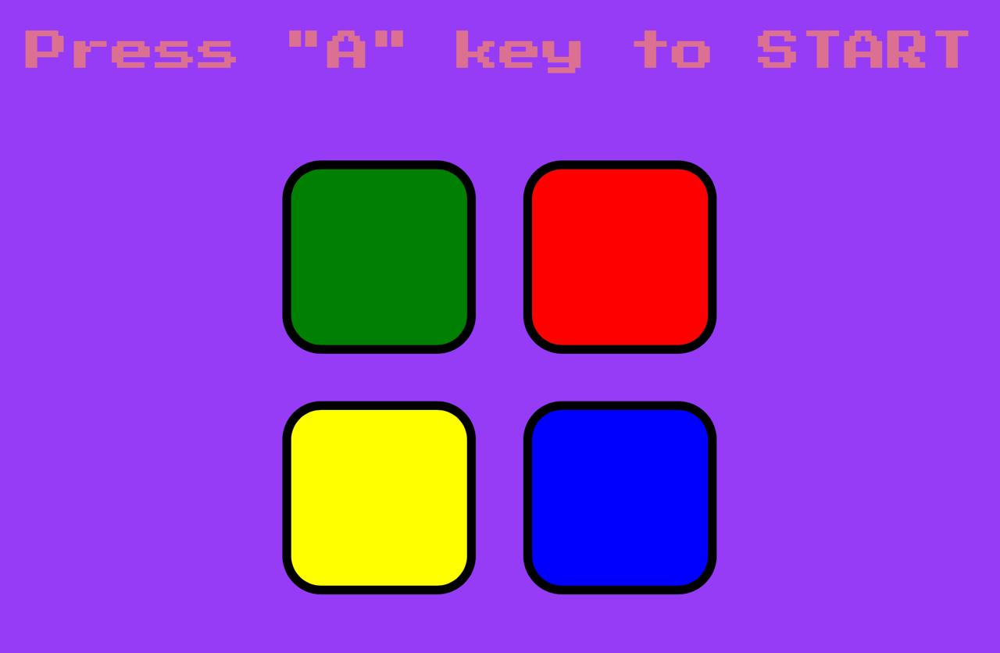

# 🎮 Simon Game

Simon Game is a classic memory-based game where players repeat an increasing sequence of colored lights and sounds. This is a fun and interactive implementation of the game.

## 🚀 Demo

  
*Replace with your actual GIF if needed.*

## 🛠 Features
- Four color buttons with unique sounds
- Randomized sequences for each game session
- Increasing difficulty as the sequence grows
- User-friendly interface with interactive feedback

## 📌 How to Play
1. Watch the pattern of flashing colors.
2. Repeat the pattern by clicking the buttons in the correct order.
3. The sequence gets longer with each correct attempt.
4. A mistake ends the game, and you can restart to try again!

## 🖥️ Installation & Usage
1. Clone this repository:
   ```bash
   git clone https://github.com/srvenu/SimonGame.git
   cd SimonGame
   ```
2. Open `index.html` in a browser.
3. Start playing and test your memory skills!

## 📷 Screenshots


## 🛠 Technologies Used
- HTML, CSS, JavaScript

## 📜 License
This project is open-source and available under the [MIT License](LICENSE).

---

🎯 **Challenge yourself to beat your highest score!**

